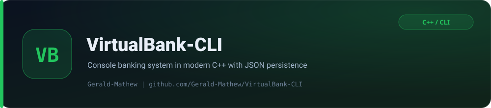

<p align="center">
  <picture>
    
  </picture>
</p>

<p align="center">
  <a href="https://github.com/gerald-mathew/VirtualBank-CLI/actions/workflows/ci.yml"></a>
</p>

<p align="center">
  <strong>A command-line banking simulator written in modern C++ with object-oriented design and JSON persistence.</strong>
</p>

<p align="center">
  
  
  
</p>
<p align="center">
  
  
  
</p>

VirtualBank simulates the everyday operations of a small bank: opening accounts, depositing and withdrawing funds, transferring money between customers, resetting PINs and inspecting a full audit trail. Every financial action is written straight to `accounts.json`, so the ledger survives between runs.

## Features

| Area | Capability |
| --- | --- |
| Accounts | Create accounts with a unique username and a four-digit PIN |
| Money | Deposit, withdraw and transfer funds with balance validation |
| Types | Savings, current and fixed-deposit account types |
| Security | PIN validation on every sensitive action and a configurable PIN reset |
| History | Every deposit, withdrawal, transfer and type change is timestamped |
| Persistence | Automatic load and save to `accounts.json` |
| Admin | Hidden admin mode (option `6789`) to inspect and delete accounts |

## Architecture

The project separates the domain model from the system layer:

| Component | File | Responsibility |
| --- | --- | --- |
| `Account` | `include/account.hpp`, `src/account.cpp` | Encapsulated balance, PIN, type and transaction history with the banking operations |
| ATM module | `include/ATM.hpp`, `src/ATM.cpp` | JSON load/save, PIN hashing, authentication and shared input validation |
| CLI | `src/main.cpp` | Menu loop and user interaction |

```text
.
├── include/
│   ├── account.hpp     # Account class definition
│   ├── ATM.hpp         # Shared system functions
│   └── json.hpp        # nlohmann/json (vendored, MIT)
├── src/
│   ├── account.cpp     # Banking logic
│   ├── ATM.cpp         # Persistence, hashing and validation
│   └── main.cpp        # Menu-driven CLI
├── compile.bat         # Polyglot build script (Windows + Unix)
└── accounts.json       # Auto-generated ledger (created on first write)
```

## Build

Compile from the project root.

**MSVC (Windows)**

```bat
cl /std:c++latest /EHsc /nologo /W4 /MTd src\account.cpp src\ATM.cpp src\main.cpp /Fe:VirtualBank.exe
```

**g++ (Linux / macOS / MinGW)**

```bash
g++ -std=c++23 -Wall src/account.cpp src/ATM.cpp src/main.cpp -Iinclude -o VirtualBank
```

Or use the bundled polyglot script, which detects MSVC, `g++` or `clang++`:

```bash
bash compile.bat        # Linux / macOS
compile.bat             # Windows
```

## Usage

Run the resulting binary and choose from the menu:

```text
1. Create Account
2. Transfer
3. Deposit Money
4. Withdraw Cash
5. Change PIN
6. Check Account Info
7. Change Account Type
8. Exit
```

Entering `6789` at the menu opens the hidden admin console, where accounts can be listed or deleted. The admin account itself is never written to disk and is protected from deletion.

## Security notes

PINs are never stored as plain text, but this project is a learning exercise rather than a production system:

- PINs are hashed with `std::hash`, which is fast and non-reversible but **not** a cryptographic hash, and its output is not guaranteed to be portable between standard libraries. A production system should use a salted, adaptive hash such as Argon2 or bcrypt.
- A four-digit PIN has a very small keyspace, so treat the ledger as a toy dataset.
- Malformed or corrupt `accounts.json` files are now reported and skipped instead of terminating the program.

## Roadmap

- Replace `std::hash` with a portable cryptographic PIN hash.
- Optional Qt desktop front end.
- Statement export to PDF and multi-currency support.

## License

Released under the [MIT License](LICENSE). Third-party: [nlohmann/json](https://github.com/nlohmann/json) (MIT, (c) 2013-2023 Niels Lohmann).

<p align="center"><sub>Built and maintained by <a href="https://github.com/gerald-mathew">Mathew Gerald Chukwudera</a></sub></p>
